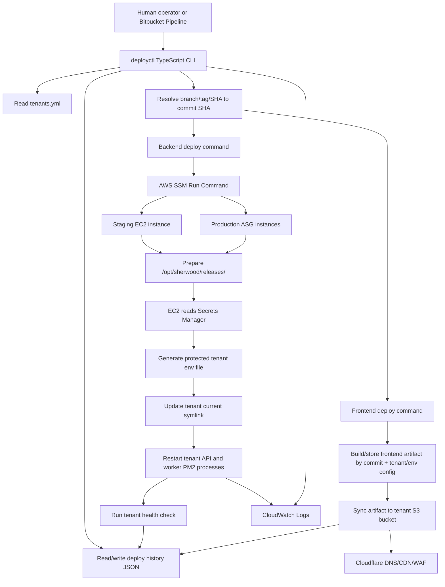

# Initial Architecture Proposal: Multi-Tenant Deployment Automation

## 1. Purpose

This proposal describes a simple first version of the multi-tenant deployment system.

The goal is to deploy backend and frontend application versions independently for each tenant without duplicating the whole repository or creating separate infrastructure stacks per tenant.

The system will sit on top of the existing AWS infrastructure. It will not modify Terraform or provision new tenant infrastructure.

## 2. Scope

Version 1 includes:

- A separate deployment automation repository.
- A TypeScript CLI called `deployctl`.
- A tenant registry file, for example `tenants.yml`.
- Backend deploys through AWS SSM onto existing EC2/ASG instances.
- Frontend deploys through reusable static build artifacts synced to tenant S3 buckets.
- Deploy history stored as JSON.
- Rollback commands for backend and frontend.
- Status and logs commands.
- Documentation for deploy, rollback, troubleshooting, and tenant config.

A web dashboard is now a confirmed requirement, but it is sequenced as a later phase built on top of the CLI's orchestration modules rather than part of the initial CLI delivery. See section 6a.

Version 1 does not include:

- Terraform changes.
- Tenant onboarding automation.
- Database provisioning.
- DNS or Cloudflare changes.
- Docker, Kubernetes, ECS, or ECR-based deploys.
- Automatic rollback.
- Database migration automation.

## 3. High-Level Architecture

The deployment system has two deploy paths:

```text
Backend:
  deployctl -> AWS SSM -> EC2 / ASG -> release directory -> tenant PM2 process

Frontend:
  deployctl -> build artifact -> tenant S3 frontend bucket -> Cloudflare
```

The backend and frontend are deployed with separate commands. This keeps the system easier to understand and avoids accidentally deploying an app that did not need to change.

```bash
deployctl deploy backend --tenant client1 --env staging --ref feature/foo
deployctl deploy frontend --tenant client1 --env staging --ref feature/foo
```

## 4. Architecture Diagram



## 5. Main Decision: Separate Deployment Automation Repo

The deployment automation should live in its own repository, separate from the application monorepo.

Recommended repository shape:

```text
deployment-automation/
  deployctl/
  tenants.yml
  bitbucket-pipelines.yml
  scripts/
  docs/
  initial-architecture-proposal.md

application-monorepo/
  backend/
  frontend/
```

Why:

`deployctl` is operational tooling. It needs access to AWS deployment permissions, tenant resource mappings, and deployment history. That is different from normal application development.

Pros:

- Keeps application code and deployment operations separate.
- Makes access control cleaner.
- Allows deployment operators to manage tenant deploy configuration without changing application code.
- Avoids exposing deployment details to every application contributor.
- Makes compliance review easier because deployment permissions are isolated.

Cons:

- The deployment repo needs read access to the application monorepo.
- Bitbucket Pipelines setup is slightly more complex.
- Operators need to understand which repo owns application code and which repo owns deployment logic.

Decision:

> Use a separate deployment automation repository for `deployctl`, `tenants.yml`, pipeline config, deploy scripts, and documentation.

Beginner explanation:

The application repository and the deployment automation repository have different jobs.

The application repository answers:

```text
What does the product do?
How do we build the backend?
How do we build the frontend?
How do developers test application changes?
```

The deployment repository answers:

```text
Which tenant should receive which version?
Which AWS bucket/process/secret belongs to that tenant?
How do we safely trigger deploys?
How do we rollback?
Who is allowed to deploy?
```

Keeping those separate reduces confusion. A developer working on application features does not automatically need access to production deployment configuration. A deployment operator does not need to modify application code just to update tenant deployment metadata.

The main tradeoff is coordination. The deployment repo must know how to fetch the app repo and build a selected commit. That is a small amount of extra setup, but it gives cleaner ownership and better security boundaries.

## 6. Main Decision: CLI-First Version 1, Dashboard Built On The Same Modules

Version 1 implementation starts CLI-only. A dashboard is now a confirmed requirement, but it is sequenced after the CLI's orchestration modules exist, not built in parallel with them.

Why:

A dashboard adds a new web-facing surface, authentication, authorization, network exposure, and audit requirements. For a healthcare platform, this is not a small addition. It is also impossible to build correctly before the deploy/rollback/lock/history logic it depends on exists, since the dashboard does not reimplement that logic — it calls it.

Pros:

- Simpler to get the deploy mechanism correct first, without two consumers in flux at once.
- Lower security risk during the highest-uncertainty phase of the project.
- Easier to audit using IAM, CloudTrail, SSM command history, Bitbucket logs, and deploy history while the CLI is the only entry point.
- The dashboard becomes a thin layer once it starts, because the hard problems (locking, history, ref resolution, deploy/rollback) are already solved.

Cons:

- The dashboard requirement is delayed relative to when it was requested.
- Operators without CLI comfort have to wait for the dashboard phase.
- Branch selection and status checks happen through terminal commands until then.

Decision:

> Version 1 implementation is CLI-first. The web dashboard is a confirmed but later phase, built once tenant registry, ref resolution, deploy history/current-state, locking, backend deploy, frontend deploy, rollback, and status/logs orchestration modules exist and are stable. See section 6a for the dashboard design.

Beginner explanation:

A dashboard is also a new application that can trigger production deploys. That means it needs authentication, authorization, network restrictions, audit logs, and careful security review.

The CLI is simpler because it can run inside Bitbucket Pipelines or on an operator machine using AWS IAM permissions. The security boundary is mostly AWS IAM plus Bitbucket access control.

In version 1, the important thing is to make the deploy mechanism correct first. The dashboard calls the same deploy logic instead of inventing a second deployment path.

This avoids a common mistake: building a UI before the underlying deploy workflow is reliable.

## 6a. Main Decision: Web Dashboard Design

A web dashboard is required, requested directly by the project owner, for deploy actions (backend and frontend deploy) and visibility (status). It is scoped initially for a single user (the project owner) but built with the same guardrails a multi-user dashboard would need, since access is expected to expand later.

Architecture:

```text
deployctl CLI        -> orchestration modules (tenant registry, ref resolution,
Web dashboard         ->   deploy history/current-state, locking, backend/frontend
                           deploy, rollback, status)
```

The dashboard is not a wrapper that shells out to the `deployctl` binary. It imports and calls the same TypeScript orchestration modules the CLI's thin command handlers call. This matches the existing convention that CLI commands are thin controllers over orchestration modules (see `CONTEXT.md`): the dashboard is a second thin controller over the same modules, not a second deployment path.

Scope for the first dashboard phase:

- Backend deploy and frontend deploy actions.
- Status visibility (current deployed version per tenant/app).
- The in-progress guardrail (see below).

Explicitly deferred to a later phase:

- Rollback through the dashboard.
- Logs through the dashboard.

Why defer rollback and logs: rollback benefits from deploy-history context that is easier to review in a CLI/terminal session than to rush into a first UI pass, and CloudWatch's own console remains a working fallback for logs in the meantime.

Concurrency guardrail:

The project owner does not want a DynamoDB or S3 lock store for this dashboard. Because the dashboard is the only entry point he uses, and because adding new lock infrastructure is disproportionate to a single-user tool, the guardrail is a lightweight `inProgress`/`since` field added to the existing `current.json` current-state record (section 23), checked and set by the orchestration module itself before starting a deploy. This is visible to any caller of the orchestration module, including the CLI, even though only the dashboard is used in practice. It is scoped per `<env>/<tenant>/<app>`, matching the existing key structure, so an in-progress deploy for one tenant/app does not block unrelated deploys.

This intentionally narrows the original deployment-lock decision in section 22 for this project: DynamoDB and S3 lock objects are not used. The `inProgress` field is a lighter-weight mechanism that solves the same problem (preventing a second deploy from starting against the same target) given a single-user dashboard as the only real caller.

Auth and access:

- Auth: basic auth or a single shared secret stored in Secrets Manager. Not Google SSO, not a full identity provider, since this is a single-user tool for now.
- Network restriction: the dashboard should not be reachable without restriction, given it can trigger production deploys for a healthcare platform. The exact mechanism is open — see Known Gaps in `CONTEXT.md`. A Google Identity-Aware Proxy (IAP) style network/access gate was mentioned but not confirmed; an IP-allowlisted security group is the fallback if IAP does not apply.
- Audit logging: every dashboard-triggered deploy or rollback should be recorded in the existing deploy-history event record (section 23), with `deployedBy` populated with the authenticated identity rather than a generic value like `"bitbucket-pipelines"`.

Hosting: the dashboard should run on its own compute, separate from the tenant-serving ASG/EC2 instances, so a dashboard issue or compromise does not share fate with tenant-facing production traffic. The exact hosting target (small dedicated instance vs. something else) is not yet confirmed.

Tech stack: a small server-rendered app (for example Express or Fastify with a lightweight templating engine or htmx for incremental interactivity), not a full SPA framework. The CLI and the rest of this project are deliberately small TypeScript tooling; the dashboard should match that, since it serves a single user today. A framework like Next.js was considered and rejected for v1 as disproportionate to the current need.

Decision:

> Build the web dashboard as a thin server-rendered TypeScript app in the same repository, calling the same orchestration modules as `deployctl`. Scope v1 to backend/frontend deploy and status, with rollback and logs deferred. Use a lightweight `inProgress` field on `current.json` instead of DynamoDB or S3 locks. Require basic auth/shared secret plus a network restriction, and record the authenticated identity in deploy history. Hosting location and the exact network-restriction mechanism remain open questions to confirm.

## 7. Main Decision: TypeScript CLI

`deployctl` should be a small TypeScript CLI running on Node.js.

Example commands:

```bash
deployctl tenants list --env staging
deployctl status --tenant client1 --env staging
deployctl deploy backend --tenant client1 --env staging --ref feature/foo
deployctl deploy frontend --tenant client1 --env staging --ref feature/foo
deployctl rollback backend --tenant client1 --env production --version abc123
deployctl rollback frontend --tenant client1 --env production --version abc123
deployctl logs --tenant client1 --env production --service api --since 1h
```

Why:

The CLI has to parse tenant config, validate inputs, call AWS APIs, record deploy history, and present clear errors. TypeScript is better suited for that than a collection of shell scripts.

Pros:

- Type-safe tenant config and command arguments.
- Better validation before running risky deploy operations.
- Easier AWS SDK usage.
- Easier testing.
- Easier structured output, for example tables or JSON.
- Fits a JavaScript/TypeScript application ecosystem.

Cons:

- More setup than basic shell scripts.
- Needs dependency management.
- The CLI should be kept small so it does not become an unnecessary platform.

Decision:

> Implement `deployctl` as a TypeScript CLI. Use shell only for small remote EC2 scripts invoked by SSM.

Beginner explanation:

Shell scripts are good for short server commands, but they become hard to maintain when the logic needs validation, AWS API calls, structured config, and good error messages.

This deployment tool needs to check things before acting:

```text
Does this tenant exist?
Is this environment valid?
Is this ref allowed in production?
Which S3 bucket should receive frontend files?
Which PM2 processes should be restarted?
Which ASG instances need the backend deploy?
```

TypeScript helps because these shapes can be modeled as types. For example, the tenant config can have required fields, and the CLI can fail before a deploy if a required field is missing.

Shell still has a place. The remote EC2 command may be a small shell script because it runs filesystem and PM2 commands on the server. The important rule is that the orchestration and validation live in TypeScript, while shell is used only for the server-local steps.

## 8. Tenant Registry

The deployment system needs a tenant registry because a tenant name alone is not enough to deploy safely.

Example:

```yaml
staging:
  client1:
    frontendBucket: skincair-staging-frontend-client1
    dbSecret: skincair/staging/db/client1
    redisSecret: skincair/staging/redis
    apiProcess: sherwood-api-client1
    workerProcess: sherwood-worker-client1
    appBaseDir: /opt/sherwood/tenants/client1
    backendHealthUrl: https://client1.sherwood.science/health
    frontendUrl: https://client1.sherwood.science
```

Important rule:

```text
tenants.yml stores names and references, not secret values.
```

Good:

```yaml
dbSecret: skincair/staging/db/client1
```

Bad:

```yaml
databasePassword: actual-password
```

Pros:

- Simple.
- Easy to review.
- Easy for the CLI to validate.
- Versioned with the deployment automation.
- Matches the brief requirement for a tenant config layer.

Cons:

- Adding a tenant requires updating the deploy repo.
- Resource names are visible to people with deploy repo access.
- If tenant count grows a lot, a service-backed registry may become better.

Decision:

> Store `tenants.yml` in the deployment automation repo. It contains tenant resource mappings and Secrets Manager paths, but never secret values.

Beginner explanation:

The CLI cannot safely deploy from just a tenant name like `client1`. It needs to translate that tenant name into actual infrastructure resources.

For example, `client1` means:

```text
use this frontend S3 bucket
use this database secret name
use this Redis secret name
restart this API PM2 process
restart this worker PM2 process
check this health URL
```

That translation is the tenant registry.

The registry should contain references, not passwords. Storing `skincair/staging/db/client1` is safe enough because it is just the name of a Secrets Manager entry. Storing the actual database password would be unsafe because it would put credentials in Git.

This design also makes deploys reviewable. If someone changes `client1` to point at a different bucket or PM2 process, that change appears in a pull request before it can affect deploys.

## 9. Commit-Based Deploys

`deployctl` can accept a branch, tag, or commit SHA as input, but every deploy must resolve that input to a full commit SHA before doing any work.

Example:

```bash
deployctl deploy backend --tenant client1 --env staging --ref feature/foo
```

At deploy start:

```text
feature/foo -> abc123
```

From that point onward, the deploy uses only:

```text
abc123
```

Why:

Branches move. A branch can point to one commit now and a different commit later. A deploy should not change if someone pushes to the branch while the deploy is running.

Deploy history should store both values:

```json
{
  "requestedRef": "feature/foo",
  "resolvedCommit": "abc123fullsha"
}
```

Production should have stricter rules:

```text
staging:
  branch, tag, or commit SHA allowed

production:
  tag or commit SHA only
```

Pros:

- Staging remains convenient.
- Production is more controlled.
- Deploy history is exact.
- Rollback can target exact versions.
- Avoids deploying a moving branch accidentally.

Cons:

- The CLI needs Git/Bitbucket access to resolve refs.
- Operators need to understand that branch input is only a convenience.
- Production requires a tag or commit SHA, which adds one extra step.

Decision:

> Deploys are commit-based. `deployctl` accepts branch/tag/SHA for staging, but production requires tag/SHA. All deploy work uses the resolved full commit SHA.

Beginner explanation:

A Git branch is a moving pointer. Today `feature/foo` might point to commit `abc123`. Tomorrow, after another push, it might point to `def456`.

A deploy should not depend on something that can move while the deploy is running. So the CLI may accept a branch for convenience, but it immediately asks Git or Bitbucket:

```text
What exact commit does this branch point to right now?
```

After that, the deploy uses only the exact commit SHA.

This means:

```text
requested input: feature/foo
resolved deploy version: abc123fullsha
```

If someone pushes new code to `feature/foo` five minutes later, the current deploy does not change. A new deploy would be needed to deploy the new commit.

Production is stricter because production deploys should be deliberate. Requiring a tag or commit SHA makes the operator choose an exact version instead of deploying whatever a moving branch happens to point to.

## 10. Backend Deploy Model: Release Directories

The backend should not use one shared mutable Git checkout.

Bad model:

```text
/opt/sherwood/app
  git pull feature/foo
  restart client1

/opt/sherwood/app
  git pull main
  restart client2
```

Problem:

```text
One folder can only contain one checked-out version at a time.
```

Recommended model:

```text
/opt/sherwood/releases/abc123
/opt/sherwood/releases/def456

/opt/sherwood/tenants/client1/current -> /opt/sherwood/releases/abc123
/opt/sherwood/tenants/client2/current -> /opt/sherwood/releases/def456
```

This is different from duplicating the repo per tenant. The release directory is created once per commit. If five tenants use `abc123`, they all point to the same release directory.

Pros:

- Supports different tenants on different backend versions.
- Avoids one tenant deploy changing code for another tenant.
- Makes rollback simple.
- Still avoids Docker.
- Still avoids a full repo clone per tenant.

Cons:

- Slightly more deploy scripting than `git pull`.
- Uses more disk than one shared checkout.
- Needs cleanup policy.
- Every production instance needs the release prepared locally.

Decision:

> Backend deploys prepare immutable release directories by commit SHA. Tenants point to releases through a `current` symlink.

Beginner explanation:

Without Docker, the backend code has to exist directly on the EC2 filesystem. The simplest approach would be one folder with `git pull`, but that breaks multi-tenant versioning.

If there is only one folder:

```text
/opt/sherwood/app
```

then that folder can only contain one version of the code. If `client1` needs commit `abc123` and `client2` needs commit `def456`, one folder cannot satisfy both at the same time.

Release directories solve this by storing each deployed version once:

```text
/opt/sherwood/releases/abc123
/opt/sherwood/releases/def456
```

Each tenant then has a small pointer called a symlink:

```text
/opt/sherwood/tenants/client1/current -> /opt/sherwood/releases/abc123
/opt/sherwood/tenants/client2/current -> /opt/sherwood/releases/def456
```

Changing a tenant's version means changing that pointer and restarting that tenant's PM2 process.

This does not violate the "no full repo copy per client" constraint because releases are per commit, not per tenant. If many tenants run the same commit, they share the same release directory.

## 11. Backend Dependencies and Build Output

Backend dependencies should be installed once per release directory, not once per tenant.

Example:

```text
/opt/sherwood/releases/abc123/backend
/opt/sherwood/releases/abc123/backend/node_modules
/opt/sherwood/releases/abc123/backend/dist
```

Tenants using that commit share the prepared release:

```text
client1/current -> /opt/sherwood/releases/abc123
client2/current -> /opt/sherwood/releases/abc123
```

Pros:

- More efficient.
- Faster deploys after the release is prepared.
- Avoids dependency differences between tenants on the same commit.
- Matches the "build once, deploy many" idea.

Cons:

- Native modules must be built on the same architecture as EC2, which is ARM64/Graviton.
- Tenant-specific backend build steps would make this harder.
- Production still needs the release prepared on each ASG instance.

Decision:

> Prepare backend dependencies and build output once per commit release directory on each target EC2 instance.

Beginner explanation:

Node applications usually need dependencies installed before they can run. That is what `npm ci` or `npm install` does. Some apps also need a build step, for example compiling TypeScript into JavaScript.

If five tenants all use the same commit, it would be wasteful to install dependencies five times. Instead, the server prepares the commit once:

```text
/opt/sherwood/releases/abc123
```

Then every tenant that uses `abc123` points to that prepared release.

This is more efficient and reduces differences between tenants. If `client1` and `client2` both run `abc123`, they should be using the same dependency install and build output.

The important limitation is that the release is local to each EC2 instance. In production, if there are three EC2 instances, each instance needs its own local `/opt/sherwood/releases/abc123`.

## 12. Backend Deploy Flow

Staging flow:

```text
1. Operator runs deployctl.
2. deployctl validates tenant/env/ref.
3. deployctl resolves ref to commit SHA.
4. deployctl reads tenants.yml.
5. deployctl sends SSM command to the staging EC2 instance.
6. EC2 prepares /opt/sherwood/releases/<commit>.
7. EC2 installs dependencies and builds backend if needed.
8. EC2 reads runtime secrets from Secrets Manager.
9. EC2 refreshes the protected tenant env file.
10. EC2 updates tenant current symlink.
11. EC2 restarts only that tenant's API and worker PM2 processes.
12. deployctl checks health.
13. deployctl records deploy history.
```

Production flow is the same idea, but it targets every healthy instance in the production ASG.

## 13. Production ASG Deploys

Production has multiple EC2 instances behind a load balancer.

Simple model:

```text
Load balancer
  -> EC2 A
  -> EC2 B
  -> EC2 C
```

Each instance has its own filesystem and PM2 processes. Updating one instance does not update the others.

Bad outcome:

```text
EC2 A -> client1 runs abc123
EC2 B -> client1 runs old999
EC2 C -> client1 runs old999
```

Users could then randomly hit different backend versions.

Pros of deploying to all ASG instances:

- All production traffic sees the same version.
- Predictable behavior.
- Uses the existing ASG architecture.
- SSM can target instances by tag or ASG membership.

Cons:

- More complex than staging.
- Partial failure is possible.
- Status must show per-instance results.
- Rollback must also run on every instance.

Decision:

> Production backend deploys run across all healthy ASG instances through SSM. The deploy is successful only if every targeted instance succeeds.

Beginner explanation:

Production does not run on only one server. It runs on an Auto Scaling Group, which is a managed group of EC2 instances. A load balancer sends traffic to those instances.

That means a user's request could go to instance A, B, or C.

If only instance A is updated, production becomes inconsistent:

```text
instance A: new version
instance B: old version
instance C: old version
```

That is dangerous because different users can see different backend behavior.

The deploy tool must therefore send the backend deploy command to every production instance currently serving traffic. AWS SSM Run Command is the mechanism for doing that without SSH.

For version 1, the rule is intentionally simple: all targeted instances must succeed. If any instance fails, the production deploy is not considered successful.

## 14. Production ASG Replacement and Reconciliation

Version 1 should account for production ASG instance replacement.

This is not a future scalability concern. The brief already says production runs on a shared ASG of 2-3 instances. An ASG can replace an instance if it becomes unhealthy, is terminated, or is recycled during maintenance. When that happens, the new instance has its own filesystem and PM2 state.

Important question:

```text
When a new production ASG instance starts, how does it know which backend version each tenant should run?
```

The brief does not say that existing AMI, launch template, user-data, or bootstrap scripts already restore tenant deploy state. Therefore, version 1 should verify this assumption before implementation.

The new instance needs enough information to reconstruct tenant runtime state:

```text
which tenants exist
which backend commit each tenant should run
which release directories must exist
which PM2 API and worker processes should exist
which Secrets Manager paths to read
which tenant env files and current symlinks to create
```

Recommended version 1 approach:

```text
1. Ask the client whether existing ASG bootstrap already restores tenant backend state.
2. If yes, document that assumption and the expected bootstrap behavior.
3. If no, provide a minimal deployctl reconcile backend command or documented recovery procedure.
```

Example command if reconciliation is needed:

```bash
deployctl reconcile backend --env production
```

The reconcile command should read the recorded desired/current backend version for each tenant and make each healthy production instance match that state.

Pros:

- Prevents replacement ASG instances from serving old, missing, or inconsistent backend code.
- Keeps production consistent across the existing 2-3 instances.
- Gives operators a recovery command if an instance drifts from the expected tenant state.
- Does not require tenant-specific infrastructure or a larger orchestration platform.

Cons:

- Adds one more operational behavior to specify and test.
- Depends on deploy history/current state being accurate.
- May require coordination with existing client-managed AMI, launch template, or user-data behavior.
- A fully automatic startup reconcile may be out of scope if Terraform/user-data changes are not allowed.

Decision:

> Version 1 must verify how production ASG replacement instances restore tenant backend state. If existing bootstrap already handles this, document that assumption. If not, provide a minimal `deployctl reconcile backend --env production` command or documented manual recovery procedure that makes all healthy production instances match recorded deploy state.

Beginner explanation:

An ASG does not only run multiple servers. It also replaces servers when AWS decides a server is unhealthy or when the group needs to maintain its desired size.

Example:

```text
Before replacement:
  EC2 A -> client1 runs abc123
  EC2 B -> client1 runs abc123

After EC2 B is replaced:
  EC2 A -> client1 runs abc123
  EC2 C -> unknown until bootstrap or reconciliation prepares it
```

The architecture needs an answer for EC2 C. Either the client's existing bootstrap already prepares the correct app state, or `deployctl` needs a way to make EC2 C match the recorded production state.

For version 1, this should stay small. The goal is not autoscaling sophistication. The goal is to avoid a basic production inconsistency when one of the existing ASG instances is replaced.

## 15. Partial Production Failure

Example:

```text
EC2 A: success
EC2 B: success
EC2 C: failed
```

Version 1 should not automatically rollback. Instead, it should:

- Mark the deploy as failed.
- Record which instances succeeded.
- Record which instances failed.
- Show the previous version.
- Show the explicit rollback command.

Example CLI output:

```text
Deploy failed: partial production deploy

Updated:
- i-aaa111 -> abc123
- i-bbb222 -> abc123

Failed:
- i-ccc333 -> npm install failed

Recommended rollback:
deployctl rollback backend --tenant client1 --env production --version old999
```

Why no automatic rollback in v1:

Automatic rollback can be useful, but it can also hide the real failure or make the situation worse if the old version is no longer compatible with shared state. Manual rollback is easier to understand and safer as a first version.

Decision:

> Version 1 detects and records partial deploys but does not automatically rollback. Automatic rollback is a future feature.

Beginner explanation:

A partial deploy means some production instances changed and others did not.

Example:

```text
instance A: deployed abc123
instance B: deployed abc123
instance C: failed and stayed on old999
```

Automatic rollback sounds attractive, but it adds a second risky action during an already failing deploy. The rollback might fail too, or the old version might no longer be compatible if something external changed.

For version 1, it is better for the tool to be very clear:

```text
This deploy failed.
These instances changed.
These instances did not.
This was the previous version.
Run this rollback command if you want to return to the previous version.
```

That gives the operator full visibility and keeps the first version easier to reason about.

## 16. PM2 Process Model

Each tenant runs as separate PM2 processes.

Example:

```text
sherwood-api-client1
sherwood-worker-client1
sherwood-api-client2
sherwood-worker-client2
```

Deploying `client1` should restart only:

```text
sherwood-api-client1
sherwood-worker-client1
```

It should not restart:

```text
sherwood-api-client2
sherwood-worker-client2
```

Pros:

- Tenant deploys are isolated.
- One tenant deploy does not interrupt another tenant.
- API and worker can be restarted together or separately if needed.

Cons:

- PM2 process naming must be consistent.
- Tenant config must map tenant ID to exact PM2 process names.
- Production instances must all use the same PM2 naming convention.

Decision:

> PM2 process names are explicit tenant config. Deploys restart only the selected tenant's API and worker processes.

Beginner explanation:

PM2 is the process manager keeping the Node backend running. In this architecture, each tenant has its own PM2 process.

That is important because a deploy for one tenant should not interrupt other tenants.

Example:

```text
client1 deploy:
  restart sherwood-api-client1
  restart sherwood-worker-client1

do not restart:
  sherwood-api-client2
  sherwood-worker-client2
```

The CLI should not guess process names. The names should come from `tenants.yml`. That way, the deploy system knows exactly which processes belong to which tenant.

This is a simple isolation boundary. Tenants share the same EC2 machine, but their running Node processes are separate.

## 17. Secrets and Environment Variables

`deployctl` should send secret references, not secret values.

Recommended flow:

```text
deployctl -> SSM command with secret names
EC2 -> Secrets Manager -> tenant PM2 environment
```

The EC2 instance reads secrets using its IAM role.

The deploy script generates or refreshes a protected env file:

```text
/opt/sherwood/tenants/client1/env.production.json
```

That file should be:

```text
chmod 600
owned by deploy/app user
not committed to Git
not printed in logs
```

Pros:

- Secrets do not pass through Bitbucket logs.
- Secrets do not pass through local operator machines.
- Uses existing AWS Secrets Manager.
- Keeps tenant runtime config separate from release code.

Cons:

- EC2 IAM permissions must be scoped correctly.
- The remote deploy script must avoid printing secrets.
- The env file contains sensitive values, so permissions matter.

Decision:

> `deployctl` passes Secrets Manager paths. EC2 reads secrets and generates a protected per-tenant env file before restarting PM2 with the updated environment.

Beginner explanation:

Secrets are values like database passwords, Redis auth tokens, and API keys. These should not appear in Git, Bitbucket logs, deploy history, or terminal output.

The deployment CLI only needs to know where the secret lives:

```text
skincair/staging/db/client1
```

It does not need to know the actual password.

The EC2 instance already runs the backend process, so it is the best place to read the runtime secrets. The deploy script on EC2 reads Secrets Manager using the EC2 instance role, writes a protected env file, and restarts PM2 with that environment.

The protected env file exists because PM2 needs a repeatable way to start the process with the right tenant-specific values. File permissions matter because the file contains secrets.

## 18. Frontend Build Artifacts

Frontend builds should be stored as versioned artifacts, but v1 cannot assume that a frontend artifact is reusable across tenants by commit SHA alone.

Current v1 model:

```text
Build per tenant/env config:
  commit abc123 + client1 staging config -> React static files
  commit abc123 + client2 staging config -> React static files

Store:
  s3://.../frontend/abc123/staging/client1.tar.gz
  s3://.../frontend/abc123/staging/client2.tar.gz

Deploy:
  abc123 + client1 artifact -> client1 S3 bucket
  abc123 + client2 artifact -> client2 S3 bucket
```

Why:

The current frontend is believed to bake tenant/environment variables into the static bundle at build time. Introducing runtime config would be a better long-term artifact model, but it would require changing every frontend client before deployment automation can ship. For v1, `deployctl` should match the existing frontend behavior.

Important distinction:

```text
Code difference -> different commit/artifact
Tenant config difference -> different artifact in v1, because config is baked into the build
```

The artifact key must therefore include more than the commit SHA:

```text
resolved commit + environment + tenant
or
resolved commit + build config fingerprint
```

Pros:

- Matches the frontend as it exists today.
- Avoids blocking v1 on a cross-tenant frontend migration.
- Keeps each tenant's baked API URL and public settings isolated.
- Frontend rollback can redeploy the exact old tenant/env artifact.

Cons:

- Requires more builds than a shared runtime-config model.
- Requires retention policy.
- Requires careful artifact keys so `client2` never receives an artifact built with `client1` variables.

Decision:

> For v1, keep frontend tenant/environment variables as build-time variables. Store frontend artifacts by resolved commit plus tenant/environment or build-config fingerprint. Do not introduce runtime config in v1; keep it as a future improvement once the frontend can read a public config file at startup.

Beginner explanation:

A React frontend usually builds into static files:

```text
index.html
assets/app.js
assets/app.css
```

Those files can be uploaded to S3 and served through Cloudflare. In an ideal model, if two tenants run the same code commit, they could share the same static build artifact.

But the current frontend appears to use build-time variables. That means the tenant's public API URL or feature flags may be baked into the JavaScript files during build.

```text
client1 + commit abc123 -> artifact with client1 API URL
client2 + commit abc123 -> artifact with client2 API URL
```

If `deployctl` stored artifacts only by commit SHA, it could accidentally reuse a `client1` build for `client2`. That is the bug this decision avoids.

Runtime config remains a good later improvement. It would let the project build once per commit and write a small per-tenant config file during S3 sync. It is deferred because it requires frontend changes outside this first deployment-automation slice.

## 19. Frontend Deploy Flow

Frontend deploy flow:

```text
1. Operator runs deployctl.
2. deployctl validates tenant/env/ref.
3. deployctl resolves ref to commit SHA.
4. deployctl computes the frontend artifact key from commit + tenant/env build config.
5. deployctl checks whether that exact artifact already exists.
6. If not, pipeline builds the frontend from that commit using tenant/env build-time variables.
7. Store artifact by commit + tenant/env/config identity.
8. Read tenant frontend bucket from tenants.yml.
9. Sync artifact files to tenant S3 bucket.
10. Run smoke check against tenant frontend URL.
11. Record deploy history.
```

Decision:

> Frontend deploys sync a versioned build artifact to the selected tenant's S3 frontend bucket. DNS and Cloudflare are not changed during deploy.

## 20. Frontend Cache Safety

Frontend deploys must define cache behavior explicitly.

A frontend deploy is not only a file copy. The tenant frontend bucket is served through Cloudflare, and browsers also cache files. If cache headers are wrong, users can see stale pages or mixed frontend versions after a deploy.

The safest baseline is:

```text
hashed JS/CSS/assets:
  cache for a long time
  example: Cache-Control: public, max-age=31536000, immutable

index.html:
  no-cache or very short cache
  example: Cache-Control: no-cache

tenant config file, for example config.json:
  no-cache or very short cache
  example: Cache-Control: no-cache
```

Why:

React builds often produce files like:

```text
assets/app.abc123.js
assets/app.def456.css
```

Those files include a content hash in the filename. If the content changes, the filename changes. These files are safe to cache for a long time.

But `index.html` usually keeps the same filename. It points the browser to the current hashed JS/CSS files. If Cloudflare or the browser keeps an old `index.html`, users may keep loading the old frontend after a deploy.

If a future runtime config file such as `config.json` is introduced, it also should not be cached for a long time because it may contain tenant-specific API URLs, feature flags, or environment settings. In v1, tenant/env frontend config is expected to be baked into the build output instead.

Recommended version 1 behavior:

```text
1. Upload hashed assets with long cache headers.
2. Upload index.html with no-cache or short-cache headers.
3. Do not immediately delete old hashed assets during deploy.
4. If Cloudflare API access is available, purge index.html after deploy.
5. If Cloudflare API access is not available, rely on short/no-cache headers and document that behavior.
6. If runtime config is added in a later phase, upload it with no-cache or short-cache headers and purge it with index.html.
```

Pros:

- Reduces stale frontend behavior after deploy.
- Avoids users loading an old `index.html` that points to missing or outdated assets.
- Keeps CDN/browser caching efficient for hashed static assets.
- Makes frontend rollback more predictable.
- Does not require changing DNS or tenant infrastructure.

Cons:

- Requires the deploy script to set different cache headers for different file types.
- Requires understanding the frontend build output.
- Cloudflare purge requires additional API credentials if used.
- Keeping old hashed assets temporarily uses more S3 storage.
- Cache behavior can be subtle and should be tested after implementation.

Decision:

> Version 1 must set frontend cache headers deliberately. Hashed static assets should use long-lived caching, while `index.html` should use no-cache or short-cache headers. Cloudflare purge for `index.html` is recommended if API access is available, but the v1 design should still work safely without DNS or Cloudflare changes. If runtime config is introduced later, it should follow the same no-cache/short-cache treatment as `index.html`.

Beginner explanation:

Browsers and Cloudflare save copies of frontend files so pages load faster. That is good for large files that change names when their content changes, such as `app.abc123.js`.

It is risky for files that keep the same name, such as `index.html`. The same would apply to a future `config.json` runtime config file.

The deploy system should therefore say:

```text
Cache big hashed assets aggressively.
Do not aggressively cache the files that tell the browser which version to load.
```

This keeps deploys predictable without turning the frontend deploy into a larger infrastructure project.

## 21. Rollback

Backend rollback:

```text
1. Find previous commit in deploy history.
2. Confirm release exists on target EC2/ASG instances.
3. If missing, prepare the old release again.
4. Repoint tenant current symlink to old release.
5. Restart tenant API and worker PM2 processes.
6. Run health check.
7. Record rollback in deploy history.
```

Frontend rollback:

```text
1. Find previous frontend artifact in deploy history.
2. Sync old artifact back to tenant S3 bucket.
3. Restore tenant config file if needed.
4. Run smoke check.
5. Record rollback in deploy history.
```

Pros:

- Backend rollback is fast if the release still exists.
- Frontend rollback uses the exact old artifact.
- Rollbacks are tenant-specific.

Cons:

- Backend rollback does not undo database changes.
- Frontend rollback requires old artifacts to be retained.
- Production rollback must run across all ASG instances.

Decision:

> Backend rollback goes back to an older release directory. Frontend rollback redeploys an older stored artifact.

Beginner explanation:

Rollback means returning one tenant to a previous known version.

For the backend, the old version is a release directory:

```text
/opt/sherwood/releases/old999
```

Rollback changes the tenant pointer:

```text
/opt/sherwood/tenants/client1/current -> /opt/sherwood/releases/old999
```

Then it restarts only `client1`'s PM2 processes.

For the frontend, the old version is a stored artifact:

```text
s3://.../frontend/old999.tar.gz
```

Rollback syncs that old artifact back into the tenant's frontend bucket.

This is why deploy history and retention are important. The tool needs to know which old versions exist and which one was previously deployed.

## 22. Deployment Guardrail

Version 1 should prevent two deploys or rollbacks from changing the same tenant application at the same time.

The guardrail should be specific to one deployment target:

```text
<env>/<tenant>/<app>
```

Examples:

```text
production/client1/backend
production/client1/frontend
staging/client1/backend
production/client2/backend
```

This means a backend deploy for `production/client1` blocks another backend deploy or rollback for `production/client1`, but it does not block unrelated deploys such as `production/client2/backend` or `production/client1/frontend`.

The guardrail should cover the whole deploy or rollback operation:

```text
1. resolve ref
2. read current state
3. prepare release or artifact
4. update symlink or sync frontend bucket
5. run health/smoke check
6. write deploy history/current state
7. clear guardrail
```

Why:

Without a guardrail, two Bitbucket pipelines or operators can deploy the same tenant/app at the same time. That can create race conditions where one deploy updates the server while another deploy overwrites deploy history, or where rollback chooses the wrong previous version.

Example bad outcome:

```text
Pipeline A deploys production/client1/backend -> abc123
Pipeline B deploys production/client1/backend -> def456

A updates the symlink.
B updates the symlink.
B writes current state.
A finishes later and writes current state.
```

The server may now be running one version while deploy history says another. That makes status and rollback unreliable.

Decision for this project:

```json
{
  "inProgress": {
    "eventId": "dep_20260617_101500",
    "since": "2026-06-17T10:15:00Z",
    "actor": "bitbucket-pipelines"
  }
}
```

Use the `inProgress` field on the existing `current.json` current-state record. Do not add a DynamoDB lock table or separate S3 lock objects in version 1. This matches the single-user dashboard requirement in section 6a and keeps the deploy-history/current-state store as the single operational record for the target.

When a deploy or rollback starts, the orchestration module reads the current-state record. If `inProgress` is already set for that target, it refuses with a clear "deploy already in progress" error. Otherwise it writes `inProgress`, performs the deploy or rollback work, and clears `inProgress` on success or failure.

Stale guardrail handling:

Deploys can fail before clearing the guardrail if a pipeline is cancelled, an operator machine disconnects, or an SSM command times out. Version 1 should show the stale `inProgress` record and require an explicit operator action to clear or retry it; it should not silently overwrite an active guardrail.

Decision:

> Version 1 includes a deployment guardrail for every deploy and rollback, keyed by `<env>/<tenant>/<app>`. The guardrail is the `inProgress` field on that target's `current.json` record. DynamoDB and S3 lock objects are not used.

Beginner explanation:

A deployment guardrail is like saying:

```text
Someone is already changing production/client1/backend.
Do not let anyone else change that same target until the first operation finishes.
```

It does not lock the whole deployment system. It only locks one target. Other tenants, environments, and apps can still deploy.

This protects the exact steps where deploys are risky: changing symlinks, restarting PM2 processes, syncing frontend files, and writing deploy history.

## 23. Deploy History

Deploy history should be stored as append-only JSON event records plus a small current-state JSON file.

Recommended storage shape:

```text
s3://skincair-<env>-deploy-history/deploys/<tenant>/backend/events/<timestamp>-<deployId>.json
s3://skincair-<env>-deploy-history/deploys/<tenant>/backend/current.json

s3://skincair-<env>-deploy-history/deploys/<tenant>/frontend/events/<timestamp>-<deployId>.json
s3://skincair-<env>-deploy-history/deploys/<tenant>/frontend/current.json
```

The event files are the audit trail. They are written once and not edited afterward.

Example event record:

```json
{
  "deployId": "dep_20260617_101500",
  "type": "deploy",
  "tenant": "client1",
  "env": "production",
  "app": "backend",
  "requestedRef": "v1.2.0",
  "resolvedCommit": "abc123fullsha",
  "status": "success",
  "startedAt": "2026-06-17T10:15:00Z",
  "finishedAt": "2026-06-17T10:18:00Z",
  "deployedBy": "bitbucket-pipelines",
  "ssmCommandId": "command-id",
  "instances": [
    {
      "instanceId": "i-aaa111",
      "status": "success",
      "version": "abc123fullsha"
    }
  ]
}
```

The `current.json` file is the fast source of current desired state for status, rollback, and ASG reconciliation.

Example current-state record:

```json
{
  "tenant": "client1",
  "env": "production",
  "app": "backend",
  "currentVersion": "abc123fullsha",
  "lastSuccessfulDeployId": "dep_20260617_101500",
  "updatedAt": "2026-06-17T10:18:00Z"
}
```

Why:

A single mutable history file mixes two different jobs:

```text
History: What happened over time?
Current state: What should be running now?
```

Those should be separate. Append-only event records preserve what happened, including failed and partial deploys. `current.json` makes common status and rollback operations easy.

Pros:

- Keeps a durable audit trail of deploys, rollbacks, failures, and partial failures.
- Reduces the risk of losing history by overwriting one file.
- Makes rollback decisions easier because previous successful versions are explicit events.
- Keeps `deployctl status` simple by reading `current.json`.
- Supports ASG replacement/reconciliation because new instances can read desired current state.
- Still uses S3 with versioning and KMS encryption as the simple version 1 storage layer.

Cons:

- Slightly more implementation work than one JSON file.
- Requires clear schemas for event records and current-state records.
- Writes to `current.json` still need deployment locks.
- Creates more S3 objects.
- A future version may prefer DynamoDB if deploy volume grows.

Decision:

> Store deploy history/state as JSON in an encrypted S3 bucket or prefix managed by the client infrastructure. Use append-only event files for history and one `current.json` file per tenant/app for current desired state. Protect writes with deployment locks.

Beginner explanation:

The CLI needs a source of truth for questions like:

```text
What backend version is client1 running?
What frontend version is client1 running?
When was it deployed?
Who deployed it?
Which version should we rollback to?
Did all production instances succeed?
```

For version 1, JSON files in S3 are enough. This avoids introducing a new database just for deploy metadata.

The event files are like a transaction history:

```text
client1 backend deployed abc123
client1 backend deploy def456 failed
client1 backend rolled back to abc123
```

The `current.json` file is like the current balance:

```text
client1 backend should currently run abc123
```

Both are useful. The history explains how the system got to its current state. The current file makes it easy for the CLI and replacement ASG instances to know what should be running now.

S3 is not as powerful as a database, but this system starts with 1-5 tenants and relatively low deploy volume. Append-only JSON files plus a small current-state file are easier to build, easier to inspect, and good enough as a baseline.

If deploy volume grows or querying becomes painful, this can move to DynamoDB later.

## 24. Logs and Status

`deployctl logs` should read from CloudWatch Logs.

Example commands:

```bash
deployctl logs --tenant client1 --env staging --service api
deployctl logs --tenant client1 --env production --service worker --since 1h
```

The brief mentions these log groups:

```text
/{project}/{env}/api
/{project}/{env}/worker
```

The CLI should filter logs by:

- environment
- tenant
- service
- time range
- instance, if production has multiple instances

Pros:

- No SSH.
- Works across production ASG instances.
- Operators do not need the AWS Console.
- Matches the brief.

Cons:

- Requires consistent CloudWatch log stream naming.
- CloudWatch filtering may be slower than local log tailing.
- If PM2 logs are not already shipped correctly, that must be fixed outside the CLI.

Decision:

> `deployctl logs` reads from CloudWatch Logs, not from server files over SSH/SSM.

Beginner explanation:

In production there may be several EC2 instances. If logs only exist as files on each server, an operator has to know which server to inspect. That is painful and error-prone.

CloudWatch Logs centralizes logs from all instances. The CLI can ask CloudWatch for recent logs matching:

```text
tenant = client1
service = api
environment = production
time range = last 1 hour
```

This keeps troubleshooting inside the deploy tool and avoids SSH. It also matches the brief, which explicitly says logs should come from CloudWatch log groups.

The only dependency is that PM2/app logs must be shipped to CloudWatch with enough tenant/process information to filter them.

## 25. Cleanup and Retention

The system needs a cleanup policy for:

```text
Backend release directories:
/opt/sherwood/releases/<commit>

Frontend artifacts:
s3://.../frontend/<commit>/<env>/<tenant-or-config-fingerprint>.tar.gz
```

Recommended baseline:

Keep:

- any version currently deployed by any tenant
- the last 10 successful versions per tenant/app
- anything deployed in the last 30 days

Version 1 cleanup should be explicit, not silent:

```bash
deployctl cleanup releases --env production --dry-run
deployctl cleanup artifacts --env production --dry-run
```

Pros:

- Prevents disk and artifact storage from growing forever.
- Keeps enough history for practical rollback.
- Protects currently deployed versions.

Cons:

- Very old rollback may require rebuilding or re-preparing.
- Cleanup logic must be careful not to delete active versions.
- Each production instance has its own backend release directories.

Decision:

> Use a simple retention policy as a baseline. Version 1 should provide dry-run cleanup commands or documentation, not silent deletion during normal deploys.

Beginner explanation:

Release directories and frontend artifacts take storage space. If nothing is ever deleted, disk usage and S3 storage will grow forever.

But deleting too aggressively is dangerous because rollback depends on old releases and artifacts still existing.

The proposed policy keeps enough history for normal rollback while preventing unlimited growth:

```text
keep current versions
keep recent successful versions
keep anything deployed recently
delete only old unused versions
```

Cleanup should be explicit in version 1. A `--dry-run` command lets the operator see what would be deleted before anything is removed.

This is safer than silently deleting files during every deploy.

## 26. Database Migrations

Database migration automation should not be part of version 1.

Why:

The brief does not explicitly require migrations. It describes deploy scripts, PM2 restarts, Secrets Manager, frontend S3 sync, logs, status, and rollback. It also says tenant onboarding and database provisioning are out of scope.

Migrations are higher risk because code rollback is easy, but database schema rollback may not be.

Pros of excluding migrations in v1:

- Simpler.
- Safer for healthcare data.
- Avoids accidental schema changes on the wrong tenant.
- Keeps rollback understandable.

Cons:

- Some releases may still need manual migration steps.
- Documentation must tell operators how to handle releases that require migrations.
- Migration automation may become necessary later.

Future feature:

```bash
deployctl migrate --tenant client1 --env staging --ref abc123
```

Only add this later if there is a known tenant-safe migration command, backup strategy, migration history, and production confirmation flow.

Decision:

> Do not include migration automation in version 1. Mention it as an explicit non-goal/risk area and a possible future feature.

Beginner explanation:

Code rollback and database rollback are very different.

Code rollback usually means:

```text
point tenant back to old release
restart PM2
```

Database rollback may mean undoing schema or data changes:

```text
remove a column
restore old data
reverse a migration
```

That is much riskier, especially in a healthcare system.

The brief does not ask for migration automation. It asks for deploy scripts, PM2 restarts, frontend sync, logs, status, rollback, and tenant config. So version 1 should not silently add database migration responsibility.

If migrations are added later, they need their own design: tenant targeting, backups, dry runs if available, production confirmations, migration history, and rollback guidance.

## 27. Security Notes

Version 1 should be secure by default:

- No dashboard.
- No SSH keys required for operators.
- SSM used for remote execution.
- Secrets stored in Secrets Manager.
- `deployctl` passes secret references, not secret values.
- EC2 reads runtime secrets using its instance role.
- Tenant env files are protected with strict permissions.
- Deploy history stores metadata, not secrets.
- Logs come from CloudWatch.
- IAM permissions should be scoped to required actions only.

Minimum IAM capabilities for the deploy pipeline/operator:

- resolve/read application source
- run SSM command against allowed instances
- read SSM command status
- acquire/release deployment locks
- sync to allowed tenant frontend buckets
- read/write deploy history bucket
- read CloudWatch logs

The EC2 instance role needs:

- read required Secrets Manager paths
- existing runtime permissions already needed by the app

## 28. Future Features

Good future enhancements:

- Dashboard support for rollback and logs (deferred from the v1 dashboard scope in section 6a).
- Multi-user dashboard access with a stronger identity/authorization model, if access expands beyond the project owner.
- Automatic rollback after partial production deploy failure.
- Database migration command with tenant-safe guardrails.
- Rolling production deploys instance by instance.
- Fully automatic ASG startup reconciliation if manual reconcile is not enough.
- DynamoDB deploy-history store if JSON files become limiting.
- Stronger approval gates for production.
- Artifact signing or checksum verification.
- Broader Cloudflare automation beyond targeted frontend cache purge.

These should not block version 1.

## 29. Proposed Version 1 Deliverables

The freelancer should deliver:

1. Architecture document with this deploy model and service diagram.
2. TypeScript `deployctl` CLI.
3. `tenants.yml` format and validation.
4. Bitbucket pipeline config in the deployment automation repo.
5. Backend deploy script invoked through SSM.
6. Frontend build/artifact/sync flow with explicit cache headers.
7. Deployment lock implementation.
8. ASG replacement bootstrap assumption or minimal backend reconcile command/procedure.
9. Deploy history JSON format.
10. Rollback commands.
11. Status and CloudWatch logs commands.
12. Operator documentation for deploy, rollback, troubleshooting, and tenant config updates.
13. Web dashboard (deploy actions and status) as a later phase, per section 6a, built once the items above are stable.

## 30. One-Sentence Summary

Use a CLI-first TypeScript deployment system where deploys are resolved to exact commit SHAs, backend releases are prepared once per commit on shared EC2/ASG instances and selected per tenant through symlinks plus PM2 restarts, while v1 frontend builds are stored as tenant/env-specific build-time-config artifacts and synced to tenant S3 buckets, with Secrets Manager, CloudWatch Logs, and JSON deploy history providing secure configuration, observability, and rollback.
