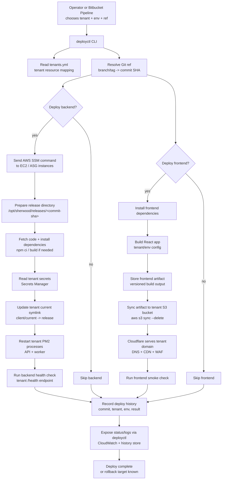

# No-Docker Architecture Explanation

This document explains the proposed no-Docker multi-tenant deployment architecture in beginner-friendly terms.

The system has two separate deployment paths:

```text
Backend path:  code -> release directory on EC2 -> PM2 process
Frontend path: code -> static files -> S3 bucket
```

Both paths are controlled by the same CLI tool.

## 1. Big Picture

There is one code repository:

```text
Bitbucket monorepo
  backend app
  frontend app
```

There are many tenants:

```text
client1
client2
client3
```

Each tenant needs its own deployed version, config, database, frontend bucket, and domain.

The architecture avoids copying the whole repository or duplicating the whole infrastructure stack for every tenant.

Instead, it uses reusable deploy outputs:

```text
Backend deploy output = release directory for a specific commit
Frontend deploy output = built React files
```

Those outputs are then pointed at the right tenant.

## 2. Main Components

The system has these parts:

```text
Bitbucket
Bitbucket Pipelines
deployctl CLI
tenants.yml
AWS SSM
EC2 / ASG
Release directories
PM2 processes
S3 frontend buckets
Cloudflare
Secrets Manager
RDS PostgreSQL
Redis
CloudWatch Logs
Deploy history
```

Each part has a specific job.

## 3. Bitbucket Monorepo

Bitbucket stores the source code.

A monorepo means the backend and frontend live in the same repository.

Example:

```text
repo/
  backend/
  frontend/
  bitbucket-pipelines.yml
```

When you choose a branch or commit, you are choosing a version of both backend and frontend code.

Examples:

```text
main
feature/new-dashboard
abc123
v1.2.0
```

## 4. Bitbucket Pipelines

Bitbucket Pipelines is the automation runner.

It can:

```text
install dependencies
run tests
call deployctl
build frontend React files
sync frontend files to S3
```

For backend deploys, Bitbucket Pipelines should not SSH into the server directly. It should call the CLI, and the CLI should use AWS SSM to run the backend deploy commands on EC2.

Recommended shape:

```text
Bitbucket Pipelines -> deployctl CLI -> AWS SSM -> EC2 -> PM2
```

## 5. deployctl CLI

`deployctl` is the command-line tool to write.

It is the brain of the deployment system.

Example commands:

```bash
deployctl deploy backend --tenant client1 --env staging --ref abc123
deployctl deploy frontend --tenant client1 --env staging --ref abc123
deployctl status --tenant client1 --env staging
deployctl rollback backend --tenant client1 --env production --ref old-sha
deployctl logs --tenant client1 --env staging --service api
```

The CLI is responsible for:

```text
reading tenant config
validating inputs
calling AWS services
triggering backend deploys through SSM
triggering frontend deploys to S3
checking health
recording deploy history
showing logs/status
```

Both humans and Bitbucket Pipelines can use it.

That matters because there should be one deployment system, not separate manual and CI deployment systems.

## 6. tenants.yml

`tenants.yml` is the map of tenants to AWS resources and runtime names.

Example:

```yaml
client1:
  frontendBucket: skincair-staging-frontend-client1
  dbSecret: skincair/staging/db/client1
  redisSecret: skincair/staging/redis
  apiProcess: sherwood-api-client1
  workerProcess: sherwood-worker-client1
  appBaseDir: /opt/sherwood/tenants/client1
  domain: client1.sherwood.science
  healthUrl: https://client1.sherwood.science/health
```

The CLI needs this because `client1` by itself is not enough.

The CLI needs to know:

```text
Which S3 bucket?
Which database secret?
Which Redis secret?
Which PM2 process name?
Which tenant app directory?
Which health URL?
```

Without a registry, the CLI would have to guess. Guessing is a bad deployment strategy.

## 7. Backend Deploy Output: Release Directory

Without Docker, the backend code runs directly on EC2 under PM2.

The naive approach would be:

```text
git pull
npm install
restart PM2
```

That is simple, but it has a problem:

> One shared checkout cannot safely support different backend branches for different tenants.

If client1 deploys `main` and client2 deploys `feature/foo`, a single shared Git checkout can only be on one branch at a time.

The safer no-Docker approach is release directories.

Example:

```text
/opt/sherwood/releases/abc123
/opt/sherwood/releases/def456
```

Each release directory contains one exact version of the backend code.

Then each tenant points to a release:

```text
/opt/sherwood/tenants/client1/current -> /opt/sherwood/releases/abc123
/opt/sherwood/tenants/client2/current -> /opt/sherwood/releases/def456
```

This lets different tenants run different versions while still sharing the same EC2 instance or ASG.

## 8. Symlinks

A symlink is a filesystem pointer.

Example:

```text
/opt/sherwood/tenants/client1/current -> /opt/sherwood/releases/abc123
```

When you deploy a new backend version for client1, the deploy script updates the symlink:

```text
/opt/sherwood/tenants/client1/current -> /opt/sherwood/releases/def456
```

Then it restarts only client1's PM2 process.

Rollback is the same idea in reverse:

```text
/opt/sherwood/tenants/client1/current -> /opt/sherwood/releases/abc123
```

This makes deploy and rollback simple without Docker.

## 9. PM2

PM2 is a Node.js process manager.

A process manager starts, stops, restarts, and supervises app processes.

Here, each tenant runs as a separate PM2 process:

```text
sherwood-api-client1
sherwood-api-client2
sherwood-worker-client1
sherwood-worker-client2
```

The deployment tool restarts the relevant PM2 process after new code is deployed.

Important rule:

> A client1 deploy should not restart client2.

## 10. API Process Vs Worker Process

The API process handles web/API traffic.

Examples:

```text
GET /health
POST /patients
GET /appointments
```

The worker process handles background jobs.

Examples:

```text
CSV imports
scheduled processing
queue jobs
```

They may use the same release directory, but start with different commands.

Example:

```bash
pm2 start npm --name sherwood-api-client1 -- run start-api
pm2 start npm --name sherwood-worker-client1 -- run start-worker
```

Same code version, different process role.

## 11. AWS SSM

SSM lets you run commands on EC2 instances without SSH.

Instead of manually logging into the server:

```bash
ssh ec2-user@server
git pull
npm install
pm2 restart ...
```

the CLI tells AWS:

```text
Run this deploy command on the staging EC2 instance.
```

AWS SSM then runs the command on the server.

This is useful because:

```text
no SSH keys
better audit trail
works with private instances
can target instances by tags
```

## 12. EC2 And ASG

EC2 is the virtual server running the backend PM2 processes.

Staging:

```text
one EC2 instance
```

Production:

```text
Auto Scaling Group with 2-3 EC2 instances
```

An ASG is a managed group of EC2 servers.

The important point:

```text
Tenants share the same servers.
```

But each tenant runs as its own PM2 process.

## 13. Backend Deploy Flow

Here is the backend flow end to end:

```text
1. Operator chooses tenant/env/ref.
2. deployctl resolves the Git ref to a commit SHA.
3. deployctl reads tenants.yml.
4. deployctl finds tenant config.
5. deployctl sends SSM command to EC2.
6. EC2 prepares /opt/sherwood/releases/<commit-sha>.
7. EC2 fetches the target code from Bitbucket.
8. EC2 installs backend dependencies.
9. EC2 updates the tenant current symlink.
10. EC2 restarts only the tenant's API PM2 process.
11. EC2 restarts only the tenant's worker PM2 process if needed.
12. deployctl checks /health.
13. deployctl records deploy history.
```

Example command:

```bash
deployctl deploy backend --tenant client1 --env staging --ref feature/foo
```

Internally, this becomes:

```text
Deploy commit abc123 to PM2 process sherwood-api-client1
```

## 14. Backend Build Location

In the no-Docker version, backend preparation usually happens on EC2.

That means the EC2 instance does:

```text
git fetch
checkout commit into release directory
npm ci
possibly run build step
restart PM2
```

This is less clean than Docker because the server is doing build/dependency work.

But it matches the existing architecture:

```text
EC2 + Git pull + PM2
```

The release-directory model improves the existing approach without introducing containers.

## 15. Secrets Manager

Secrets Manager stores sensitive config.

Examples:

```text
database username
database password
Redis auth token
API secrets
tenant-specific feature flags
```

The tenant registry stores secret names, not secret values.

Example:

```yaml
dbSecret: skincair/staging/db/client1
```

At deploy time, the deploy system reads that secret and passes it to the PM2 process as environment variables.

This avoids putting passwords in Git or Bitbucket config.

## 16. Environment Variables

Environment variables are configuration values passed to the running app.

Example:

```text
DATABASE_URL=...
REDIS_URL=...
TENANT_ID=client1
CORS_ORIGIN=https://client1.sherwood.science
```

Each tenant PM2 process gets different environment variables.

That is how the same code can behave differently for different tenants.

The code version may be the same or different, but the tenant config is always different.

## 17. RDS PostgreSQL

RDS is the managed PostgreSQL database.

Each tenant has its own database and credentials.

Example:

```text
client1 API process -> client1 database
client2 API process -> client2 database
```

This is data isolation.

The deploy system does not create these databases. It only gives the app the credentials it needs to connect.

## 18. Redis / ElastiCache

Redis is used for fast shared state, caching, queues, or background job coordination.

ElastiCache is AWS's managed Redis.

The API and worker processes may both connect to Redis.

Example:

```text
client1 API -> Redis
client1 worker -> Redis
```

Redis credentials should also come from Secrets Manager.

## 19. CloudWatch Logs

CloudWatch Logs stores logs from the running backend processes.

When something fails, you want:

```bash
deployctl logs --tenant client1 --env staging --service api
```

The CLI should fetch logs from CloudWatch so the operator does not need to manually search AWS Console.

Logs are important for:

```text
debugging failed deploys
checking app errors
audit/support investigations
```

## 20. Frontend Artifact

The frontend is different from the backend.

A React frontend usually builds into static files:

```text
index.html
assets/app.js
assets/app.css
```

Those files do not need a running Node server.

The frontend deploy path is:

```text
build React app
upload static files to S3
Cloudflare serves them to users
```

The frontend artifact is the built folder.

## 21. S3 Frontend Buckets

Each tenant has its own S3 bucket for frontend files.

Example:

```text
skincair-staging-frontend-client1
skincair-staging-frontend-client2
```

Deploying frontend for client1 means:

```bash
aws s3 sync build/ s3://skincair-staging-frontend-client1/ --delete
```

This replaces the files for client1's frontend.

It does not affect client2.

## 22. Cloudflare

Cloudflare sits in front of the frontend and probably the backend/API routing.

It handles:

```text
DNS
CDN caching
WAF/security rules
tenant domains
```

Example:

```text
client1.sherwood.science -> Cloudflare -> S3 frontend / backend API
```

The deploy system usually does not need to change Cloudflare during normal deploys.

DNS is already configured during tenant onboarding.

## 23. Frontend Deploy Flow

Frontend flow:

```text
1. Operator chooses tenant/env/ref.
2. Bitbucket checks out the code.
3. Pipeline builds React app.
4. Build output is stored as an artifact.
5. deployctl reads tenants.yml.
6. deployctl finds tenant frontend bucket.
7. deployctl syncs files to S3.
8. deployctl checks the tenant URL.
9. deployctl records deploy history.
```

Example command:

```bash
deployctl deploy frontend --tenant client1 --env staging --ref feature/foo
```

Internally:

```text
Build frontend from feature/foo
Upload files to skincair-staging-frontend-client1
```

## 24. Deploy History

Deploy history records what happened.

Example:

```json
{
  "tenant": "client1",
  "environment": "staging",
  "app": "backend",
  "requestedRef": "feature/foo",
  "resolvedCommit": "abc123",
  "releaseDir": "/opt/sherwood/releases/abc123",
  "deployedAt": "2026-06-16T10:00:00Z",
  "deployedBy": "bitbucket-pipelines",
  "healthStatus": "passed"
}
```

This lets you answer:

```text
What is client1 running?
Who deployed it?
When?
What was running before?
Can we roll back?
```

Deploy history can live in S3 or DynamoDB.

For a simple first version, S3 JSON files may be enough.

## 25. Rollback

Rollback means going back to a previous working version.

Backend rollback:

```text
point tenant symlink back to previous release directory
restart tenant PM2 process
```

Example:

```bash
deployctl rollback backend --tenant client1 --env production --ref old-sha
```

Frontend rollback:

```text
sync previous frontend artifact back to S3
```

Example:

```bash
deployctl rollback frontend --tenant client1 --env production --artifact build-123
```

Deploy history tells you which previous commit/artifact to use.

## 26. Why Release Directories Matter

Release directories are the no-Docker way to avoid the shared checkout problem.

Bad model:

```text
one shared folder
git pull branch A
restart client1
git pull branch B
restart client2
```

Problem:

```text
The shared folder can only contain one branch/version at a time.
```

Better model:

```text
/opt/sherwood/releases/abc123
/opt/sherwood/releases/def456

client1/current -> abc123
client2/current -> def456
```

This lets tenants share compute without sharing the same active code checkout.

## 27. What Still Needs Design

The no-Docker architecture still needs these details specified:

```text
How are release directories created exactly?
How are old releases cleaned up?
How does PM2 receive tenant-specific env vars?
How does production deploy across 2-3 EC2 instances?
Should production deploy all instances at once or one by one?
How are failed dependency installs handled?
How are CloudWatch logs mapped to tenant/process names?
Does the app need database migrations?
How do we prevent two deploys to the same tenant at the same time?
```

These are not reasons to abandon the approach. They are design details that must be specified.

## 28. One-Sentence Architecture

Use a CLI-driven deployment system where backend deploys use AWS SSM to prepare commit-based release directories on shared EC2/ASG instances and restart tenant-specific PM2 processes, while frontend deploys build static React files and sync them to tenant-specific S3 buckets behind Cloudflare, with Secrets Manager, CloudWatch, and deploy history providing secure configuration, observability, and rollback.

## 29. Clean Pipeline Diagram


